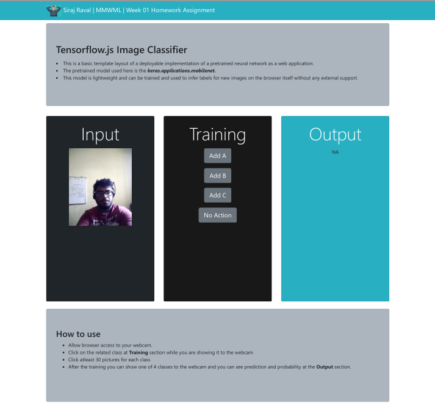

## Basic Web App for a DNN model

This is a DNN-based image classifier which is powered by **Tensorflow.js** . You can train your classifier (4 classes) on the fly in the browser. This application is using pre-trained model for image classification called **MobileNet**. Your model will be trained on top of this one to customize the image classes it recognizes. So you can create highly accurate model with minimal training data.

## How to use

- Allow your browser to reach you webcam.
- You can set 4 different classes at the application. Click on the related class at **Training** section while you are showing it to the webcam
- After the training you can show one of 4 classes to the webcam and you can see prediction and probability at the **Output** section.

**Note:** Minimum **30 images** per class will increase the accuracy.

## How the webpage design looks

## References for help
- [Eray Onler](https://bit.ly/2PlsE1n) (Another fellow student of MMWML)
- [TensorflowJS Official DIY Projects](https://github.com/tensorflow/tfjs-examples)

## Additional remarks

- I am not a fan of web applications and I actively stay away from them.
- I do not have a working knowledge of Web Technology in CSS, JS, and relevant frameworks.
- I used [Eray](https://bit.ly/2PlsE1n)'s template to understand how to put the DNN model up for browser-based inference.
